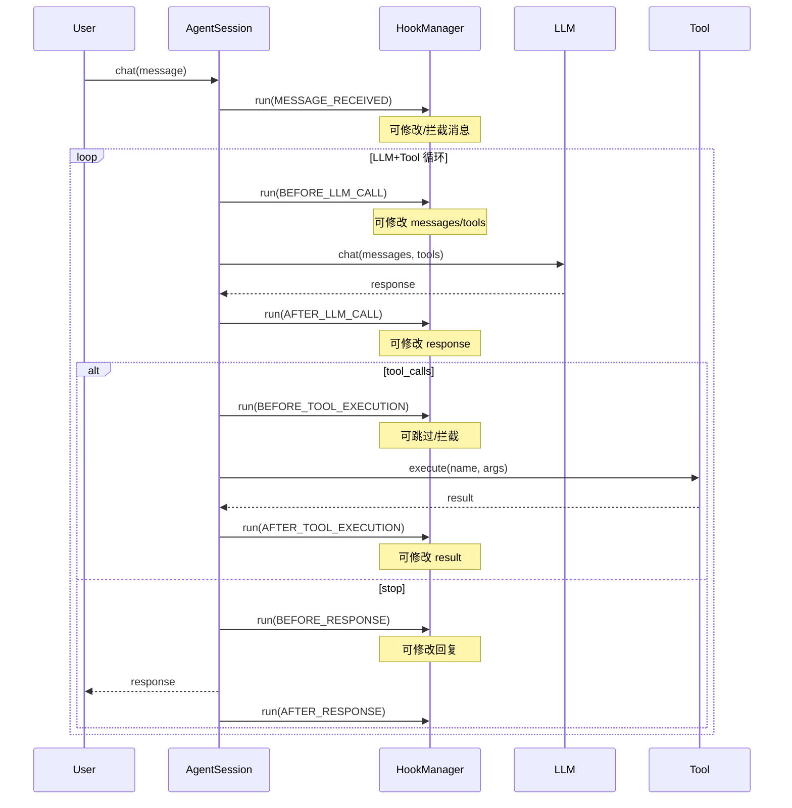

# SmallShrimp Hooks 系统设计文档

---

## 1. 为什么需要 Hooks

### 1.1 项目现状

SmallShrimp 是一个 AI Agent 框架，目前已具备以下基础设施：

- **EventBus** (`core/eventbus.py`): 发布/订阅模式的事件总线，支持 `subscribe` / `publish` / `run`，用于跨组件异步通信
- **Agent Loop** (`core/agent.py`): 完整的 `chat → LLM call → tool execution → repeat → response` 循环
- **ToolGuardrails** (`core/tool_guardrails.py`): 工具调用的护栏检测（仅一个 `after_call` hook 点）
- **Permissions** (`core/permissions.py`): 7 层防御体系，在工具执行前进行权限检查
- **Channels** (`channels/base.py`): 消息通道的 `on_message` 回调注册
- **Scattered Callbacks**: `set_on_tool_call()`、`set_on_thinking()`、`set_confirm_fn()` — 三套独立的回调注入方式

### 1.2 现有痛点

| # | 痛点 | 表现 |
|---|------|------|
| 1 | **回调散落** | `_on_tool_call`、`_on_thinking`、`_confirm_fn` 是三个各自独立的回调注入方式，新增一个观察点就得加一个新的 `set_xxx` 方法和属性 |
| 2 | **无法扩展** | 第三方 Skill 或自定义 Worker 无法在 Agent 生命周期关键节点注入逻辑（比如"每次工具执行前记录日志"、"每次 LLM 调用后校验输出格式"） |
| 3 | **EventBus 未用于生命周期** | EventBus 目前仅用于 InboundEvent / OutboundEvent 等系统级消息，Agent 内部的 LLM 调用、工具执行等阶段没有对应事件 |
| 4 | **无法中断/转换** | 现有回调都是 Observe-only，无法在特定阶段中断流程或修改传递的数据 |
| 5 | **无优先级控制** | 多个 hook 注册后谁先谁后不可控 |

### 1.3 类似项目参考

- **Claude Code**: `.claude/hooks/` 目录下的可执行脚本钩子（pre-tool / post-tool）
- **LangChain**: `LangChainCallbackHandler` 接口，20+ 生命周期回调
- **VSCode Extension**: `activationEvents` + `Disposable` 模式

---

## 2. 设计目标

设计并实现一个 **统一的 Hooks 系统**，满足以下要求：

### 2.1 功能目标

1. **全生命周期覆盖** — 定义 Agent 从消息入到响应出的所有关键阶段
2. **Observe 与 Intercept 双模式** — 既允许只读监听，也允许拦截修改行为
3. **一致的注册方式** — 消除 `set_on_xxx` 分散回调，统一为 `hooks.register(event, handler)`
4. **优先级排序** — 同一 hook 点允许多个 handler，按优先级顺序执行
5. **异步友好** — 所有 hook handler 均为 async function
6. **与现有 EventBus 协同** — EventBus 作为事件传输层，Hooks 作为 Agent 内部生命周期管理

### 2.2 非功能目标

- 零侵入性 —— 不改变现有 Agent 的核心执行流程
- 向后兼容 —— 保留现有的 `set_on_tool_call` / `set_on_thinking` 作为快捷方式
- 可测试 —— 每个 hook 点可单独 mock 和验证
- 可序列化 —— Hook 执行记录可打入日志或持久化

---

## 3. 设计方案

### 3.1 架构总览

```
┌──────────────────────────────────────────────────────────────────┐
│                        Agent Loop                                │
│                                                                  │
│  ┌──────────┐   ┌──────────┐   ┌────────────┐   ┌───────────┐  │
│  │  Message  │──▶│  LLM     │──▶│  Tool      │──▶│  Response │  │
│  │  Received │   │  Call    │   │  Execution │   │  Send     │  │
│  └─────┬─────┘   └────┬─────┘   └─────┬──────┘   └─────┬─────┘  │
│        │              │               │                │        │
│        ▼              ▼               ▼                ▼        │
│  ┌────────────────────────────────────────────────────────┐      │
│  │                   HookManager                          │      │
│  │                                                        │      │
│  │  on_msg    before_llm   before_tool   before_resp     │      │
│  │  received  after_llm    after_tool    after_resp      │      │
│  │            on_error                                    │      │
│  └────────────────────────────────────────────────────────┘      │
│           │              │               │                │       │
│           ▼              ▼               ▼                ▼       │
│  ┌────────────────────────────────────────────────────────┐      │
│  │                   EventBus (可选桥接)                    │      │
│  │  转发关键 hook → 系统事件，供其他 Worker 订阅            │      │
│  └────────────────────────────────────────────────────────┘      │
└──────────────────────────────────────────────────────────────────┘
```

### 3.2 Hook 点定义

#### 3.2.1 全部 Hook 点一览

| Hook 名称 | 触发时机 | 荷载数据 | 可拦截 | 默认优先级 |
|-----------|---------|---------|--------|-----------|
| `on_session_start` | AgentSession 创建时 | `session_id, source, agent_def` | ❌ | 100 |
| `on_message_received` | 收到用户消息后 | `message: str, session_state` | ✅ 可修改 message | 200 |
| `before_llm_call` | LLM 调用前 | `messages, tools, session_state` | ✅ 可修改 messages/tools | 300 |
| `after_llm_call` | LLM 返回后 | `response, session_state` | ✅ 可修改 response | 400 |
| `before_tool_execution` | 单个工具执行前 | `tool_name, args, session_state` | ✅ 可拦截（跳过/改写） | 500 |
| `after_tool_execution` | 单个工具执行后 | `tool_name, args, result, failed, session_state` | ✅ 可修改 result | 600 |
| `before_response` | Agent 回复前 | `response: str, session_state` | ✅ 可修改 response | 700 |
| `after_response` | 回复发送后 | `response: str, session_state` | ❌ | 800 |
| `on_session_end` | 会话结束时 | `session_id, summary` | ❌ | 900 |
| `on_error` | 任何阶段出错时 | `error: Exception, phase: str, session_state` | ❌ (记录用) | 1000 |

#### 3.2.2 拦截机制说明

可拦截的 hook 点允许 handler 返回一个 **Action** 来改变行为：

```python
class HookAction:
    """Hook handler 的返回类型，决定后续流程。"""
    
    # observe 模式：只观察，不干预
    OBSERVE = "observe"
    
    # intercept 模式：修改数据，继续流程
    MODIFY = "modify"
    
    # intercept 模式：跳过当前操作
    SKIP = "skip"
    
    # intercept 模式：完全中断流程
    ABORT = "abort"
```

### 3.3 HookManager 核心设计

```python
# src/SmallShrimp/core/hooks.py

from __future__ import annotations
import asyncio
import logging
from dataclasses import dataclass, field
from enum import Enum
from typing import Any, Awaitable, Callable, Generic, TypeVar

logger = logging.getLogger(__name__)

# ── Hook 点枚举 ────────────────────────────────────────────

class HookPoint(str, Enum):
    SESSION_START = "on_session_start"
    MESSAGE_RECEIVED = "on_message_received"
    BEFORE_LLM_CALL = "before_llm_call"
    AFTER_LLM_CALL = "after_llm_call"
    BEFORE_TOOL_EXECUTION = "before_tool_execution"
    AFTER_TOOL_EXECUTION = "after_tool_execution"
    BEFORE_RESPONSE = "before_response"
    AFTER_RESPONSE = "after_response"
    SESSION_END = "on_session_end"
    ERROR = "on_error"

# ── Hook 结果 ──────────────────────────────────────────────

@dataclass
class HookResult:
    """Hook handler 的执行结果。"""
    action: str = "observe"  # observe | modify | skip | abort
    data: Any = None         # 修改后的数据（modify 模式时有效）
    message: str = ""        # abort/skip 时的原因

# ── Handler 类型 ───────────────────────────────────────────

HookHandler = Callable[..., Awaitable[HookResult]]

@dataclass
class RegisteredHook:
    """已注册的 hook 条目。"""
    handler: HookHandler
    priority: int = 500
    name: str = ""            # 可选标识，便于调试和日志

# ── HookManager ────────────────────────────────────────────

class HookManager:
    """统一的 Hook 管理器，管理 Agent 全生命周期回调。"""

    def __init__(self) -> None:
        self._hooks: dict[HookPoint, list[RegisteredHook]] = {
            point: [] for point in HookPoint
        }

    def register(
        self,
        point: HookPoint | str,
        handler: HookHandler,
        *,
        priority: int = 500,
        name: str = "",
    ) -> Callable[[], None]:
        """注册一个 hook handler。

        Args:
            point: HookPoint 枚举或字符串名称
            handler: async handler 函数
            priority: 优先级（数字越小越先执行，默认 500）
            name: handler 名称（用于调试/日志）

        Returns:
            取消注册的可调用对象（类似 VSCode Disposable）
        """
        if isinstance(point, str):
            point = HookPoint(point)

        hook = RegisteredHook(handler=handler, priority=priority, name=name)
        self._hooks[point].append(hook)
        self._hooks[point].sort(key=lambda h: h.priority)

        # 返回 unsubscribe 函数
        def unsubscribe() -> None:
            self._hooks[point].remove(hook)

        return unsubscribe

    def unregister(self, point: HookPoint | str, handler: HookHandler) -> None:
        """取消注册指定 handler。"""
        if isinstance(point, str):
            point = HookPoint(point)
        self._hooks[point] = [
            h for h in self._hooks[point] if h.handler != handler
        ]

    async def run(
        self,
        point: HookPoint | str,
        context: dict[str, Any],
        *,
        abort_on: set[str] | None = None,
    ) -> HookResult:
        """执行指定 hook 点的所有 handler。

        Args:
            point: Hook 点
            context: 传递给 handler 的上下文数据
            abort_on: 遇到哪些 action 时提前中止执行后续 handler

        Returns:
            聚合后的 HookResult（最后一个 modify 结果 + 最高优先级的中断）
        """
        if isinstance(point, str):
            point = HookPoint(point)

        final = HookResult(action="observe")
        handlers = self._hooks.get(point, [])

        for hook in handlers:
            try:
                result = await hook.handler(context)
            except Exception as e:
                logger.error(f"Hook '{hook.name or hook.handler.__name__}' "
                             f"在 {point.value} 出错了: {e}")
                continue

            # 记录最后 observe/modify 的结果
            if result.action in ("observe", "modify"):
                final = result

            # abort — 立即停止链
            if result.action == "abort":
                return result

            # skip — 停止后续 handler，但保留之前的结果
            if result.action == "skip":
                break

        return final

    def clear(self, point: HookPoint | str | None = None) -> None:
        """清空指定或全部 hook。"""
        if point is None:
            for p in self._hooks:
                self._hooks[p].clear()
        else:
            if isinstance(point, str):
                point = HookPoint(point)
            self._hooks[point].clear()
```

### 3.4 Agent 集成点

在 `AgentSession` 中集成 HookManager，在每个生命周期关键点触发 hook。

```python
# 在 AgentSession.__post_init__ 中
self.hooks = HookManager()

# 注册旧的 set_on_xxx 回调（向后兼容）
if self._on_tool_call:
    self.hooks.register(
        HookPoint.AFTER_TOOL_EXECUTION,
        lambda ctx: self._on_tool_call_callback(ctx),
    )
```

**集成位置对照表**：

| 现有代码位置 | 插入 Hook 点 | 影响 |
|-------------|-------------|------|
| `Agent.new_session()` 末尾 | `hooks.run(SESSION_START, ...)` | 会话创建通知 |
| `AgentSession.chat()` 收到用户消息后 | `hooks.run(MESSAGE_RECEIVED, ..., abort_on={"abort"})` | 可修改/拦截消息 |
| `AgentSession.chat()` LLM 调用前 | `hooks.run(BEFORE_LLM_CALL, ..., abort_on={"abort"})` | 可修改 messages/tools |
| `AgentSession.chat()` LLM 返回后 | `hooks.run(AFTER_LLM_CALL, ..., abort_on={"abort"})` | 可修改 response |
| `_execute_tool_calls()` 每个工具执行前 | `hooks.run(BEFORE_TOOL_EXECUTION, ..., abort_on={"skip", "abort"})` | 可跳过/拦截工具 |
| `_execute_tool_calls()` 每个工具执行后 | `hooks.run(AFTER_TOOL_EXECUTION, ...)` | 可修改 result |
| `AgentSession.chat()` 返回前 | `hooks.run(BEFORE_RESPONSE, ..., abort_on={"abort"})` | 可修改回复内容 |
| `ChatLoop.handle_inbound_event` 发送后 | `hooks.run(AFTER_RESPONSE, ...)` | 响应后通知 |
| `AgentSession.chat()` 异常捕获处 | `hooks.run(ERROR, ...)` | 错误记录/通知 |

### 3.5 Hook Handler 示例

#### 3.5.1 Observe 模式 — 审计日志

```python
async def audit_log_hook(ctx: dict) -> HookResult:
    """记录每次工具调用到日志文件。"""
    phase = ctx.get("_hook_point", "")
    logger.info(f"[Hook] {phase}: {ctx}")
    return HookResult(action="observe")

# 注册
hooks.register("after_tool_execution", audit_log_hook, priority=100, name="audit_log")
```

#### 3.5.2 Intercept 模式 — 敏感词过滤

```python
SENSITIVE_KEYWORDS = ["password", "token", "secret"]

async def filter_sensitive_info(ctx: dict) -> HookResult:
    """在回复前过滤敏感信息。"""
    response = ctx.get("response", "")
    for word in SENSITIVE_KEYWORDS:
        response = response.replace(word, "[REDACTED]")
    return HookResult(action="modify", data={"response": response})

# 注册
hooks.register("before_response", filter_sensitive_info, priority=100, name="sensitive_filter")
```

#### 3.5.3 Intercept 模式 — 安全拦截

```python
DANGEROUS_TOOLS = {"shell_exec", "run_in_terminal"}

async def block_dangerous_tools(ctx: dict) -> HookResult:
    """阻止危险工具在 untrusted 模式下执行。"""
    tool_name = ctx.get("tool_name", "")
    if tool_name in DANGEROUS_TOOLS:
        return HookResult(
            action="skip",
            message=f"Tool '{tool_name}' is blocked by security policy",
        )
    return HookResult(action="observe")

# 注册
hooks.register("before_tool_execution", block_dangerous_tools, priority=0, name="security_block")
```

### 3.6 与 EventBus 的协同

HookManager 主要负责 **Agent 内部同步生命周期**，EventBus 负责 **跨组件的异步事件分发**。两者可以桥接：

```python
class EventBridge:
    """将 Hook 事件桥接到 EventBus，供外部 Worker 订阅。"""

    def __init__(self, hook_manager: HookManager, eventbus: EventBus):
        # 在关键 hook 点自动 publish EventBus 事件
        hook_manager.register(
            HookPoint.AFTER_TOOL_EXECUTION,
            self._on_tool_executed,
            priority=9999,  # 最后执行
            name="eventbus_bridge",
        )

    async def _on_tool_executed(self, ctx: dict) -> HookResult:
        """将工具执行事件转发到 EventBus。"""
        event = ToolExecutedEvent(
            session_id=ctx.get("session_id", ""),
            tool_name=ctx.get("tool_name", ""),
            result=ctx.get("result", ""),
            failed=ctx.get("failed", False),
        )
        await self._eventbus.publish(event)
        return HookResult(action="observe")
```

### 3.7 配置文件支持

允许通过 YAML 配置注册预定义的 hook handler（通过插件/技能机制加载）：

```yaml
# workspace/config.user.yaml
hooks:
  # 内置 hook
  audit_log:
    point: after_tool_execution
    enabled: true
  
  # 技能提供的 hook
  sensitive_filter:
    point: before_response
    enabled: false
```

### 3.8 实现计划

| 阶段 | 内容 | 工时估计 |
|------|------|---------|
| **Phase 1** | 实现 `HookPoint` 枚举 + `HookResult` + `HookManager` 核心类 + 完整单元测试 | 1-2 天 |
| **Phase 2** | 在 `AgentSession` 各生命周期点插入 `hooks.run()` 调用 + 替换 `set_on_xxx` 回调 | 1 天 |
| **Phase 3** | 实现 EventBus 桥接 + YAML 配置加载 | 0.5 天 |
| **Phase 4** | Skills/Plugins 可以通过 `hook_manager.register()` 扩展自身行为 | 0.5 天 |

---

## 4. 预期效果

### 4.1 预期收益

| 维度 | 改善前 | 改善后 |
|------|--------|--------|
| **扩展性** | 要加新观察点必须改 AgentSession 源码，新增 `set_on_xxx` 属性 | 任何人/技能只需 `hooks.register(point, handler)` |
| **可观测性** | 只有 tool_call 和 thinking 两个回调 | 10 个生命周期 hook 点，全覆盖 |
| **控制力** | 回调只能 observe，无法修改数据或中断流程 | observe / modify / skip / abort 四种模式 |
| **一致性** | `_on_tool_call`、`_on_thinking`、`_confirm_fn` 三种不同机制 | 单一 `HookManager.register()` 入口 |
| **与 EventBus 关系** | 割裂，EventBus 只管系统事件 | 可桥接，关键 hook 事件自动 publish 到 EventBus |
| **安全性** | 权限检查耦合在 tool execution 中 | 可通过 `before_tool_execution` hook 叠加安全策略 |

### 4.2 典型使用场景

1. **审计日志**：在 `after_tool_execution` 注册 handler，记录所有工具调用
2. **敏感信息过滤**：在 `before_response` 注册 handler，自动脱敏
3. **技能扩展**：Skill 通过注册 `before_llm_call` 动态注入 system prompt
4. **安全策略**：第三方安全插件通过 `before_tool_execution` 拦截危险命令
5. **性能监控**：在 `before_llm_call` / `after_llm_call` 记录 LLM 调用耗时
6. **多 Agent 编排**：父 Agent 通过 `after_response` hook 做结果校验

### 4.3 迁移路径

1. `_on_tool_call` → 内部注册到 `AFTER_TOOL_EXECUTION` hook，零改动
2. `_on_thinking` → 内部注册到 `AFTER_LLM_CALL` hook，零改动
3. `_confirm_fn` → 保留为权限系统的专属接口（不变）
4. 新功能直接使用 `hooks.register()`，不再新增 `set_on_xxx`

---

## 5. 附录

### 5.1 完整生命周期时序图



### 5.2 文件变更清单

| 文件 | 变更类型 | 说明 |
|------|---------|------|
| `src/SmallShrimp/core/hooks.py` | **新增** | HookPoint + HookResult + HookManager |
| `src/SmallShrimp/core/agent.py` | 修改 | AgentSession 集成 HookManager + 生命周期调用 |
| `src/SmallShrimp/core/eventbus.py` | 不变 | 保持现有 EventBus |
| `src/SmallShrimp/server/context.py` | 可选修改 | 全局 HookManager 注入 |
| 测试文件 | 新增 | `tests/test_hooks.py` |
