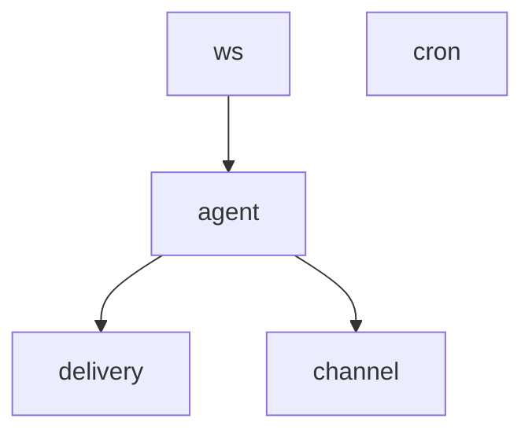

# Worker DAG 编排 — 产品需求文档

> 版本: v0.1 | 日期: 2026-06-25 | 状态: 草案
> 涉及层: Core / Server

---

## 1. 产品概述

### 1.1 产品定位

将 `server/workers/` 和 `core/worker.py` 中 Worker 的启动/执行模型从**线性并行的 Workers 列表**升级为**有向无环图（DAG）编排**，支持 Worker 间依赖关系、条件分支和结果传递。

### 1.2 核心价值

| 痛点（现状） | 解决 |
|---|---|
| `Server._setup_workers()` 将 Workers 存入列表，全部并行启动 | Worker 间可定义依赖关系（如 CronWorker → MemRefreshWorker） |
| 无条件执行能力 | 支持条件分支：'AgentWorker 繁忙时 → 消息入队而非直发' |
| Worker 间无法传递结果 | DAG 边可以携带数据，下游 Worker 接收上游产出 |
| 崩溃重启策略单一（全部重启） | 按 DAG 拓扑序重启，依赖已就绪的上游 |

### 1.3 目标用户

- **框架开发者**：编排复杂多 Worker 流水线（聊天 → 记忆 → 投递 → 归档）
- **Server 运维**：清晰可见的 Worker 依赖图和健康状态

---

## 2. 功能范围

### 2.1 MVP（P0 — 必须实现）

| 模块 | 功能 | 说明 |
|------|------|------|
| **WorkerGraph** | DAG 定义 | `add_node(worker, deps=[...], condition=...)` 声明式注册 |
| **WorkerGraph** | 拓扑排序启动 | 按拓扑序启动 Workers，上游未就绪时下游等待 |
| **WorkerGraph** | 依赖检查 | `has_crashed()` 时自动停止所有下游 |
| **WorkerGraph** | 可视化 | `graph.mermaid()` 输出 Mermaid 图 |

### 2.2 V1（P1 — 体验完善）

| 模块 | 功能 |
|------|------|
| **WorkerGraph** | 条件节点 `condition=worker_busy_or_not` |
| **WorkerGraph** | 节点重试策略：`retry=3, retry_delay=5` |
| **WorkerGraph** | 上下文数据传递：`node.output → downstream.input` |

### 2.3 V2（P2 — 高级功能）

| 模块 | 功能 |
|------|------|
| **WorkerGraph** | 动态图（运行时增删节点） |
| **WorkerGraph** | Web UI 查看 DAG 状态和执行历史 |

---

## 3. 技术架构

### 3.1 当前实现

```python
class Server:
    def _setup_workers(self):
        self.workers = [
            AgentWorker(self.context),     # SubscriberWorker
            DeliveryWorker(self.context),  # SubscriberWorker
            CronWorker(self.context),      # 主动 Worker
            ws_worker,                     # SubscriberWorker
        ]

    def _start_workers(self):
        for worker in self.workers:
            worker.start()
```

### 3.2 目标实现

```python
class Server:
    def _setup_workers(self):
        import asyncio
        from .workers.graph import WorkerGraph, node

        self.graph = WorkerGraph()

        # 定义 DAG
        ws = WebSocketWorker(self.context)
        agent = AgentWorker(self.context)
        delivery = DeliveryWorker(self.context)
        cron = CronWorker(self.context)
        channel = ChannelWorker(self.context) if has_channels else None

        self.graph.add_node(node(id="ws", worker=ws))
        self.graph.add_node(node(id="agent", worker=agent, deps=["ws"]))
        self.graph.add_node(node(id="delivery", worker=delivery, deps=["agent"]))
        self.graph.add_node(node(id="cron", worker=cron))
        if channel:
            self.graph.add_node(node(id="channel", worker=channel, deps=["agent"]))

    async def run(self):
        await self.graph.start()

        try:
            await self._monitor()  # 按拓扑序监控崩溃
        except asyncio.CancelledError:
            await self.graph.stop()
```

### 3.3 WorkerGraph 核心

```python
@dataclass
class Node:
    id: str
    worker: Worker
    deps: list[str] = field(default_factory=list)
    condition: Callable[[], bool] | None = None  # V1
    retry: int = 0
    retry_delay: float = 5.0
    output: Any = None

class WorkerGraph:
    """DAG Worker 图。"""

    def __init__(self):
        self._nodes: dict[str, Node] = {}
        self._started: set[str] = set()

    def add_node(self, node: Node) -> None:
        self._nodes[node.id] = node

    async def start(self) -> None:
        """按拓扑排序启动所有节点。"""
        order = self._topological_sort()
        for node_id in order:
            node = self._nodes[node_id]
            if node.condition and not node.condition():
                logger.info(f"Node '{node_id}' skipped (condition false)")
                continue
            node.worker.start()
            self._started.add(node_id)

    def _topological_sort(self) -> list[str]:
        """Kahn 算法拓扑排序。"""
        in_degree = {}
        for nid, node in self._nodes.items():
            in_degree.setdefault(nid, 0)
            for dep in node.deps:
                in_degree[nid] = in_degree.get(nid, 0) + 1

        queue = [nid for nid, deg in in_degree.items() if deg == 0]
        result = []
        while queue:
            nid = queue.pop(0)
            result.append(nid)
            for other_nid, other_node in self._nodes.items():
                if nid in other_node.deps:
                    in_degree[other_nid] -= 1
                    if in_degree[other_nid] == 0:
                        queue.append(other_nid)

        if len(result) != len(self._nodes):
            raise ValueError("Cycle detected in worker graph")
        return result

    def dependents_of(self, node_id: str) -> list[str]:
        """获取指定节点的所有下游依赖者。"""
        return [
            nid for nid, node in self._nodes.items()
            if node_id in node.deps
        ]

    async def _monitor(self):
        """监控崩溃 - 有依赖关系的按拓扑序处理。"""
        while True:
            for node_id, node in self._nodes.items():
                if node.worker.has_crashed():
                    # 停止所有下游
                    for dep_id in self.dependents_of(node_id):
                        dep = self._nodes[dep_id]
                        await dep.worker.stop()
                    # 重启（带重试）
                    for attempt in range(1, node.retry + 2):
                        ...
            await asyncio.sleep(1)

    def mermaid(self) -> str:
        """输出 Mermaid 图。"""
        lines = ["graph TD"]
        for nid, node in self._nodes.items():
            for dep in node.deps:
                lines.append(f"  {dep} --> {nid}")
        return "\n".join(lines)
```

---

## 4. 后端 API 层设计

| 端点 | 方法 | 用途 | 优先级 |
|------|------|------|--------|
| `GET /api/worker-graph` | GET | 返回 DAG 结构（JSON） | P1 |

---

## 5. 默认 DAG 拓扑



说明：
- `ws` (WebSocket) 是最上游，建立连接后 Agent 才可接收消息
- `agent` 依赖 `ws`，接收 WebSocket 入站消息
- `delivery` 依赖 `agent`，Agent 产出 OutboundEvent 后投递
- `channel` (IM 渠道) 也依赖 `agent`
- `cron` 是独立节点，无上游依赖

---

## 6. 测试要点

| 场景 | 说明 |
|------|------|
| 拓扑排序 | 正确顺序：无依赖 → 单依赖 → 链式依赖 |
| 环检测 | 注册循环依赖 → 抛出 ValueError |
| 条件跳过 | condition=False 的节点不启动，下游也不影响 |
| 崩溃传播 | 上游崩溃 → 下游自动停止 |
| Mermaid 输出 | `graph.mermaid()` 输出合法的 mermaid 语法 |

---

## 7. 里程碑

| 阶段 | 内容 | 工期 |
|------|------|------|
| P0 | WorkerGraph + Node 数据结构 + 拓扑排序 + 依赖监控 + Mermaid 输出 | 3d |
| P0+ | Server 接入 WorkerGraph | 1d |
| P1 | 条件节点 + 重试策略 + 数据传递 | 2d |
| P2 | 动态图 + Web UI 状态查看 | 2d |

---

## 8. 风险 & 缓解

| 风险 | 影响 | 缓解措施 |
|------|------|----------|
| 图过大时拓扑排序复杂度 | 启动延迟 | Kahn 算法 O(V+E)，实际节点 ≤ 20，无性能问题 |
| 条件节点误判导致下游饥饿 | 消息积压 | 条件节点超时后 fallback 为启动 |

---

## 9. 附录

### 9.1 参考产品

- **Apache Airflow DAG**：成熟的 DAG 编排模型
- **Celery Canvas (chain/group/chord)**：Worker 间编排范式

### 9.2 变更文件

| 文件 | 变更类型 |
|------|----------|
| `src/SmallShrimp/server/workers/graph.py` | 新增 — WorkerGraph |
| `src/SmallShrimp/server/server.py` | 修改 — 接入 WorkerGraph |
| `src/SmallShrimp/core/worker.py` | 修改 — Worker 增加 `output` 属性支持数据传递 |

### 9.3 变更记录

| 日期 | 版本 | 变更 |
|------|------|------|
| 2026-06-25 | v0.1 | 初始草案 |
